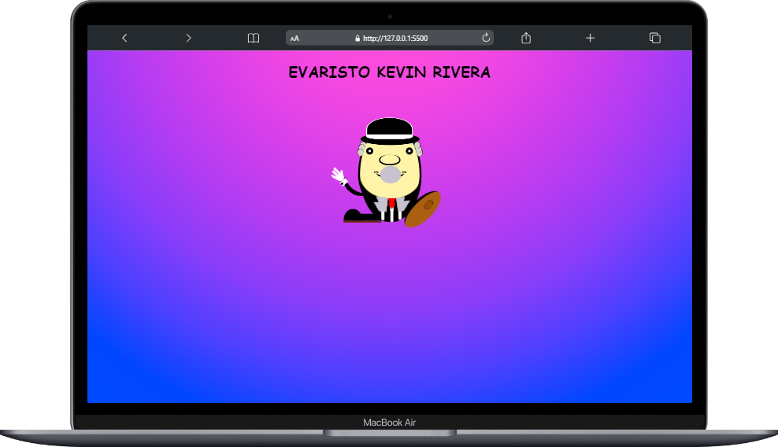

# Dibujo en CSS - EVARISTO

Este proyecto consiste en crear un dibujo de un personaje llamado "EVARISTO" utilizando solo CSS y HTML. El objetivo es demostrar habilidades en la creación de diseños con CSS.

## Tabla de Contenidos

1. [Descripción](#descripción)
2. [Capturas de Pantalla](#capturas-de-pantalla)
3. [Demo en Vivo](#demo-en-vivo)
4. [Tecnologías Utilizadas](#tecnologías-utilizadas)
5. [Instalación](#instalación)
6. [Configuración](#configuración)
7. [Uso](#uso)
8. [Características](#características)
9. [Contribución](#contribución)

## Descripción

Este proyecto es un ejemplo de cómo se puede crear una representación artística utilizando solo HTML y CSS. El dibujo de "EVARISTO" es un personaje ficticio con detalles visuales interesantes.

## Capturas de Pantalla

<div align="center">
    
</div>

<div align="center">
    
</div>

## Demo en Vivo

Puedes ver una demostración en vivo del dibujo de "EVARISTO" [aquí](https://kevinrivera1.github.io/Evaristo-CSS/).

## Tecnologías Utilizadas

- HTML5
- CSS3

## Instalación

Para instalar este proyecto, ejecuta el siguiente comando en tu terminal:

```bash
git clone https://github.com/KevinRivera1/Evaristo-CSS.git
```

Ejecuta el archivo `index.html` en un navegador web.

## Configuración

No se requiere configuración especial para este proyecto.

## Uso

Puedes utilizar este proyecto como inspiración para tus propios diseños en CSS o como ejemplo de cómo crear arte digital utilizando tecnologías web.


## Características

- Uso creativo de HTML y CSS para crear un dibujo artístico.
- Detalles visuales como ojos, boca, nariz, ropa, y más.
- Animaciones o efectos visuales (si los incluyes).

## Contribución

Si deseas contribuir a este proyecto, siéntete libre de hacerlo mediante solicitudes de extracción (pull requests) en GitHub. También puedes abrir problemas (issues) si encuentras algún error o deseas sugerir mejoras. ¡Toda contribución es bienvenida!